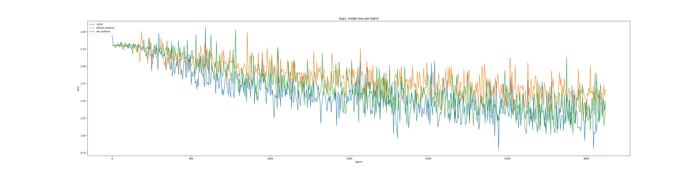

# Introduction
For the homework, the two netwrok architectures (i.e. Strided-CNN, and All-CNN) are both implemented. Additionally, the Layer-sequential unit-variance (LSUV) initialization is also implemented. I implemented them both in Tensorflow and Keras. 

The implementations of Strided-CNN and LSUV in Tensorflow are mainly for the purpose of demonstration of knowledge of Tensorflow. For later training and optimization, they are done using Keras (as Prof. Bhiksha says it is ok to use Keras in this HW). The summary of each file is as follows:

- strided_CNN_tf_LSUV.py
    - implementation of Strided-CNN, All-CNN and LSUV
    - no further optimizations
    
- strided_CNN_keras.py
    - implementation of Strided-CNN and All-CNN
    - actual configurations for training including data agumentation, parameters choice, and 

# Network Architecture
My implementation of Strided CNN and All CNN follows the architecture of Strided-CNN-C and All-CNN-C in the paper. The summary of the architecture is shown in the table below:

|           | Strided-CNN-C                                                                       | All-CNN-C                                                                           |
|-----------|-------------------------------------------------------------------------------------|-------------------------------------------------------------------------------------|
| Conv1     | 3 input channel, 3*3 filter, 96 ReLU, stride = 1 (?, 32, 32, 96)                    | 3 input channel, 3*3 filter, 96 ReLU, stride = 1 (?, 32, 32, 96)                    |
| Conv2     | 96 input channel, 3*3 filter, 96 ReLU, stride = 2 (?, 16, 16, 96)                   | 96 input channel, 3*3 filter, 96 ReLU, stride = 1 (?, 32, 32, 96)                   |
| Conv3     | 96 input channel, 3*3 filter, 192 ReLU, stride = 1 (?, 16, 16, 192)                 | 96 input channel, 3*3 filter, 192 ReLU, stride = 2 (?, 16, 16, 192)                 |
| Droupout1 | P(droupout) = 0.5                                                                   | P(droupout) = 0.5                                                                   |
| Conv4     | 192 input channel, 3*3 filter, 192 ReLU, stride = 2 (?, 8, 8, 192)                  | 192 input channel, 3*3 filter, 192 ReLU, stride = 1 (?, 16, 16, 192)                |
| Conv5     | 192 input channel, 3*3 filter, 192 ReLU, stride = 2, padding = valid (?, 6, 6, 192) | 192 input channel, 3*3 filter, 192 ReLU, stride = 1 (?, 16, 16, 192)                |
| Conv6     | 192 input channel, 1*1 filter, 192 ReLU, stride = 1, padding = valid (?, 6, 6, 192) | 192 input channel, 3*3 filter, 192 ReLU, stride = 2 (?, 8, 8, 192)                  |
| Droupout2 | P(droupout) = 0.5                                                                   | P(droupout) = 0.5                                                                   |
| Conv7     | 192 input channel, 1*1 filter, 10 ReLU, stride = 1 (?, 6, 6, 10)                    | 192 input channel, 3*3 filter, 192 ReLU, stride = 1, padding = valid (?, 6, 6, 192) |
| Conv8     |                                                                                     | 192 input channel, 1*1 filter, 192 ReLU, stride = 1 (?, 6, 6, 192)                  |
| Conv9     |                                                                                     | 192 input channel, 1*1 filter, 10 ReLU, stride = 1 (?, 6, 6, 10)                    |
| GAP       | 10 input channel, 6*6 filter, stride = 1, padding = same (?, 1, 1, 10)              | 10 input channel, 6*6 filter, stride = 1, padding = same (?, 1, 1, 10)              |
| Softmax   | 10-way softmax of flat representation (?, 1, 10) of GAP output                      | 10-way softmax of flat representation (?, 1, 10) of GAP output                      |
     
- (?, n, n, n) represents the output of each layer where ? is the number of input images

## Weight Initialization
When working with deep neural networks, initializing the network with the right weights can be the difference between the network converging in a reasonable amount of time and the network loss function not going anywhere even after hundreds of thousands of iterations.

In short, the weight initialization is of great important for training a network:

- If the weights in a network start too small, then the signal shrinks as it passes through each layer until it’s too tiny to be useful.
- If the weights in a network start too large, then the signal grows as it passes through each layer until it’s too massive to be useful.

# Based on Gaussian Distribution
Without knowing about the training data, one good way of initialization is to assign the weights from a Gaussian distribution which has zero mean and some finite variance. 

# Glorot normal Initialization (Xavier Initialization)
The motivation for Xavier initialization in neural networks is to initialize the weights of the network so that the neuron activation functions are not starting out in saturated or dead regions. In other words, we want to initialize the weights with random values that are not "too small" and not "too large". Specifically, it draws samples from a truncated normal distribution centered on 0 with `stddev = sqrt(2 / (fan_in + fan_out))` where `fan_in is` the number of input units in the weight tensor and `fan_out` is the number of output units in the weight tensor.

# LSUV Initialization
Layer-sequential unit-variance (LSUV) initialization is an extension of  orthonormal initialization Saxe et al. (2014) to an iterative procedure proposed by Mishkin et al. (2015)[1]. First, it fills the weights with Gaussian noise with unit variance. Second, decompose them to orthonormal basis with QR or SVD-decomposition and replace weights with one of the components. The LSUV process then estimates output variance of each convolution and inner product layer and scales the weight to make variance equal to one. The proposed scheme can be viewed as an orthonormal initialization combined with batch normal- ization performed only on the first mini-batch.

The idea of a data-driven weight initialization, rather than theoretical computation for all layer types, is very attractive: as ever more complex nonlinearities and network architectures are devised, it is more and more difficult to obtain clear theoretical results on the best initialization. This paper elegantly sidesteps the question by numerically rescaling each layer of weights until the output is approximately unit variance. The simplicity of the method makes it likely to be used in practice, although the absolute performance improvements from the method are quite small.

# He Uniform Initialization
It draws samples from a uniform distribution within `[-limit, limit]` where `limit` is `sqrt(6 / fan_in)` where `fan_in` is the number of input units in the weight tensor[2].

# Experiments
Due to the lack of GPU resources and long training process, I have no choice but to only train fewer than 10 epoches for each different parameter setting for evaluation. The evaluation metrics include the accuracy, loss, and the speed of convergency on test set. The experiments are mainly focued on the following three parameters:

1. Different ways of weight initialization
2. Different training strateies
3. Different training optimizers
4. Different ways of image preprocessing    

## Experiment: weight initialization

| Parameter    | Setting                                                                                       |
|--------------|-----------------------------------------------------------------------------------------------|
| Training     | SGD: lr=0.01, decay=1e-6, momentum=0.9, nesterov                                              |
| Optimizer    | dropout                                                                                       |
| Prepocessing | horizontally and vertically shift within the range of 10%, horizontal flipping, zca whitening |

In my first experiment, I compared the effectiveness of different initialization strategies. Specifically, LSUV initialization, Glorot normal initialization, He uniform initialization, together with simple Gaussian distribution initialization are compared.

LSUV and normal weight initialization. As figures shown below, LSUV achieves best performance in first 3000 batches.

- experiment#1: LSUV, SGD(lr=0.01, decay=1e-6, momentum=0.9, nesterov=True), horizontally and vertically shift within the range of 10%, horizontal flipping
- experiment#2: zca_whitening

# Reference
[1] Mishkin D, Matas J. All you need is a good init[J]. arXiv preprint arXiv:1511.06422, 2015.

[2] He K, Zhang X, Ren S, et al. Delving deep into rectifiers: Surpassing human-level performance on imagenet classification[C]//Proceedings of the IEEE international conference on computer vision. 2015: 1026-1034.
MLA 
